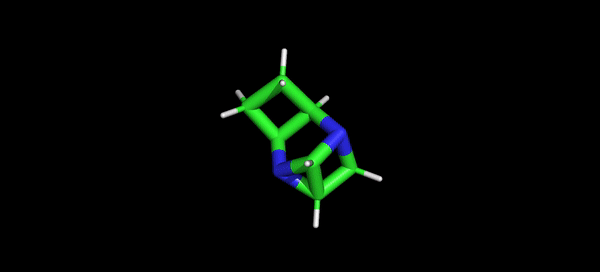

<div align="center">

# Bio-Diffusion

<a href="https://pytorch.org/get-started/locally/"></a>
<a href="https://pytorchlightning.ai/"></a>
<a href="https://hydra.cc/"></a>
[](https://arxiv.org/abs/2302.04313)
<!-- [](https://papers.nips.cc/paper/2020) -->
[](https://doi.org/10.5281/zenodo.7542177)
[](https://doi.org/10.5281/zenodo.7647653)


</div>

## Description

A PyTorch hub of denoising diffusion probabilistic models designed to generate novel biological data



## How to run

Install Mamba

```bash
wget "https://github.com/conda-forge/miniforge/releases/latest/download/Mambaforge-$(uname)-$(uname -m).sh"
bash Mambaforge-$(uname)-$(uname -m).sh  # accept all terms and install to the default location
rm Mambaforge-$(uname)-$(uname -m).sh  # (optionally) remove installer after using it
source ~/.bashrc  # alternatively, one can restart their shell session to achieve the same result
```

Install dependencies

```bash
# clone project
git clone https://github.com/BioinfoMachineLearning/bio-diffusion
cd bio-diffusion

# create conda environment
mamba env create -f environment.yaml
conda activate bio-diffusion  # note: one still needs to use `conda` to (de)activate environments

# install local project as package
pip3 install -e .
```

Add or upgrade dependencies
```bash
# when installing a new package with pip or conda
# e.g., pip3 install .....

# update master configuration of environment layout
mamba env export | head -n -1 > environment.yaml

# also, be sure to remove the line `- bio-diffusion==0.0.1` from the list of `pip` dependencies generated

# push environment changes to remote for others to see
git add environment.yaml && git commit -m "Update Conda environment" && git push origin main

# then, others can update their local environments as follows
git pull origin main
mamba env update -f environment.yaml
```

Download data
```bash
# initialize data directory structure
mkdir -p data

# fetch, extract, and clean-up preprocessed data
cd data/
wget https://zenodo.org/record/7542177/files/EDM.tar.gz
tar -xzf EDM.tar.gz
rm EDM.tar.gz
cd ../
```

Download checkpoints

**Note**: Make sure to be located in the project's root directory beforehand (e.g., `~/bio-diffusion/`)
```bash
# fetch and extract model checkpoints directory
wget https://zenodo.org/record/7647653/files/GCDM_Checkpoints.tar.gz
tar -xzf GCDM_Checkpoints.tar.gz
rm GCDM_Checkpoints.tar.gz
```

## How to train

Train model with default configuration

```bash
# train on CPU
python src/train.py trainer=cpu

# train on GPU
python src/train.py trainer=gpu
```

Train model with chosen experiment configuration from [configs/experiment/](configs/experiment/)

```bash
python src/train.py experiment=experiment_name.yaml
```

Train a model for *unconditional* small molecule generation with the QM9 dataset (**QM9**)

```bash
python3 src/train.py experiment=qm9_mol_gen_ddpm.yaml
```

Train a model for *property-conditional* small molecule generation with the QM9 dataset (**QM9**)

```bash
# choose a value for `model.module_cfg.conditioning` from the properties `[alpha, gap, homo, lumo, mu, Cv]`
python3 src/train.py experiment=qm9_mol_gen_conditional_ddpm.yaml model.module_cfg.conditioning=[alpha]
```

**Note**: You can override any parameter from command line like this

```bash
python src/train.py trainer.max_epochs=20 datamodule.dataloader_cfg.batch_size=64
```

## How to evaluate

Reproduce our results for *unconditional* small molecule generation with the QM9 dataset

```bash
qm9_model_1_ckpt_path="checkpoints/QM9/Unconditional/model_1_epoch_979-EMA.ckpt"
qm9_model_2_ckpt_path="checkpoints/QM9/Unconditional/model_2_epoch_979-EMA.ckpt"
qm9_model_3_ckpt_path="checkpoints/QM9/Unconditional/model_3_epoch_1099-EMA.ckpt"

python3 src/mol_gen_eval.py datamodule=edm_qm9 model=qm9_mol_gen_ddpm logger=csv trainer.accelerator=gpu trainer.devices=1 ckpt_path="$qm9_model_1_ckpt_path" datamodule.dataloader_cfg.num_workers=1 model.diffusion_cfg.sample_during_training=false num_samples=10000 sampling_batch_size=100 num_test_passes=5
python3 src/mol_gen_eval.py datamodule=edm_qm9 model=qm9_mol_gen_ddpm logger=csv trainer.accelerator=gpu trainer.devices=1 ckpt_path="$qm9_model_2_ckpt_path" datamodule.dataloader_cfg.num_workers=1 model.diffusion_cfg.sample_during_training=false num_samples=10000 sampling_batch_size=100 num_test_passes=5
python3 src/mol_gen_eval.py datamodule=edm_qm9 model=qm9_mol_gen_ddpm logger=csv trainer.accelerator=gpu trainer.devices=1 ckpt_path="$qm9_model_3_ckpt_path" datamodule.dataloader_cfg.num_workers=1 model.diffusion_cfg.sample_during_training=false num_samples=10000 sampling_batch_size=100 num_test_passes=5
```

Reproduce our results for *property-conditional* small molecule generation with the QM9 dataset

```bash
qm9_alpha_generator_model_filepath="checkpoints/QM9/Conditional/alpha_model_epoch_1619-EMA.ckpt"
qm9_gap_generator_model_filepath="checkpoints/QM9/Conditional/gap_model_epoch_1659-EMA.ckpt"
qm9_homo_generator_model_filepath="checkpoints/QM9/Conditional/homo_model_epoch_1879-EMA.ckpt"
qm9_lumo_generator_model_filepath="checkpoints/QM9/Conditional/lumo_model_epoch_1619-EMA.ckpt"
qm9_mu_generator_model_filepath="checkpoints/QM9/Conditional/mu_model_epoch_1859-EMA.ckpt"

qm9_alpha_classifier_model_dir="checkpoints/QM9/Property_Classifiers/exp_class_alpha"
qm9_gap_classifier_model_dir="checkpoints/QM9/Property_Classifiers/exp_class_gap"
qm9_homo_classifier_model_dir="checkpoints/QM9/Property_Classifiers/exp_class_homo"
qm9_lumo_classifier_model_dir="checkpoints/QM9/Property_Classifiers/exp_class_lumo"
qm9_mu_classifier_model_dir="checkpoints/QM9/Property_Classifiers/exp_class_mu"

python3 src/mol_gen_eval_conditional_qm9.py datamodule=edm_qm9 model=qm9_mol_gen_ddpm logger=csv trainer.accelerator=gpu trainer.devices=1 datamodule.dataloader_cfg.num_workers=1 model.diffusion_cfg.sample_during_training=false generator_model_filepath="$qm9_alpha_generator_model_filepath" classifier_model_dir="$qm9_alpha_classifier_model_dir" property=alpha iterations=100 batch_size=100
python3 src/mol_gen_eval_conditional_qm9.py datamodule=edm_qm9 model=qm9_mol_gen_ddpm logger=csv trainer.accelerator=gpu trainer.devices=1 datamodule.dataloader_cfg.num_workers=1 model.diffusion_cfg.sample_during_training=false generator_model_filepath="$qm9_gap_generator_model_filepath" classifier_model_dir="$qm9_gap_classifier_model_dir" property=gap iterations=100 batch_size=100
python3 src/mol_gen_eval_conditional_qm9.py datamodule=edm_qm9 model=qm9_mol_gen_ddpm logger=csv trainer.accelerator=gpu trainer.devices=1 datamodule.dataloader_cfg.num_workers=1 model.diffusion_cfg.sample_during_training=false generator_model_filepath="$qm9_homo_generator_model_filepath" classifier_model_dir="$qm9_homo_classifier_model_dir" property=homo iterations=100 batch_size=100
python3 src/mol_gen_eval_conditional_qm9.py datamodule=edm_qm9 model=qm9_mol_gen_ddpm logger=csv trainer.accelerator=gpu trainer.devices=1 datamodule.dataloader_cfg.num_workers=1 model.diffusion_cfg.sample_during_training=false generator_model_filepath="$qm9_lumo_generator_model_filepath" classifier_model_dir="$qm9_lumo_classifier_model_dir" property=lumo iterations=100 batch_size=100
python3 src/mol_gen_eval_conditional_qm9.py datamodule=edm_qm9 model=qm9_mol_gen_ddpm logger=csv trainer.accelerator=gpu trainer.devices=1 datamodule.dataloader_cfg.num_workers=1 model.diffusion_cfg.sample_during_training=false generator_model_filepath="$qm9_mu_generator_model_filepath" classifier_model_dir="$qm9_mu_classifier_model_dir" property=mu iterations=100 batch_size=100
```

## How to sample
*Unconditionally* generate small molecules similar to those contained within the QM9 dataset

```bash
qm9_model_ckpt_path="checkpoints/QM9/Unconditional/model_1_epoch_979-EMA.ckpt"
output_dir="./"

python3 src/mol_gen_sample.py datamodule=edm_qm9 model=qm9_mol_gen_ddpm logger=csv trainer.accelerator=gpu trainer.devices=1 ckpt_path="$qm9_model_ckpt_path" num_samples=250 num_nodes=19 all_frags=true sanitize=false relax=false num_resamplings=1 jump_length=1 num_timesteps=1000 output_dir="$output_dir"
```

*Property-conditionally* generate small molecules similar to those contained within the QM9 dataset

```bash
qm9_alpha_model_ckpt_path="checkpoints/QM9/Conditional/alpha_model_epoch_1619-EMA.ckpt"
qm9_gap_model_ckpt_path="checkpoints/QM9/Conditional/gap_model_epoch_1659-EMA.ckpt"
qm9_homo_model_ckpt_path="checkpoints/QM9/Conditional/homo_model_epoch_1879-EMA.ckpt"
qm9_lumo_model_ckpt_path="checkpoints/QM9/Conditional/lumo_model_epoch_1619-EMA.ckpt"
qm9_mu_model_ckpt_path="checkpoints/QM9/Conditional/mu_model_epoch_1859-EMA.ckpt"
output_dir="./"

python3 src/mol_gen_eval_conditional_qm9.py datamodule=edm_qm9 model=qm9_mol_gen_ddpm logger=csv trainer.accelerator=gpu trainer.devices=1 datamodule.dataloader_cfg.num_workers=1 model.diffusion_cfg.sample_during_training=false generator_model_filepath="$qm9_alpha_model_ckpt_path" property=alpha iterations=100 batch_size=100 sweep_property_values=true num_sweeps=10 output_dir="$output_dir"
python3 src/mol_gen_eval_conditional_qm9.py datamodule=edm_qm9 model=qm9_mol_gen_ddpm logger=csv trainer.accelerator=gpu trainer.devices=1 datamodule.dataloader_cfg.num_workers=1 model.diffusion_cfg.sample_during_training=false generator_model_filepath="$qm9_gap_model_ckpt_path" property=gap iterations=100 batch_size=100 sweep_property_values=true num_sweeps=10 output_dir="$output_dir"
python3 src/mol_gen_eval_conditional_qm9.py datamodule=edm_qm9 model=qm9_mol_gen_ddpm logger=csv trainer.accelerator=gpu trainer.devices=1 datamodule.dataloader_cfg.num_workers=1 model.diffusion_cfg.sample_during_training=false generator_model_filepath="$qm9_homo_model_ckpt_path" property=homo iterations=100 batch_size=100 sweep_property_values=true num_sweeps=10 output_dir="$output_dir"
python3 src/mol_gen_eval_conditional_qm9.py datamodule=edm_qm9 model=qm9_mol_gen_ddpm logger=csv trainer.accelerator=gpu trainer.devices=1 datamodule.dataloader_cfg.num_workers=1 model.diffusion_cfg.sample_during_training=false generator_model_filepath="$qm9_lumo_model_ckpt_path" property=lumo iterations=100 batch_size=100 sweep_property_values=true num_sweeps=10 output_dir="$output_dir"
python3 src/mol_gen_eval_conditional_qm9.py datamodule=edm_qm9 model=qm9_mol_gen_ddpm logger=csv trainer.accelerator=gpu trainer.devices=1 datamodule.dataloader_cfg.num_workers=1 model.diffusion_cfg.sample_during_training=false generator_model_filepath="$qm9_mu_model_ckpt_path" property=mu iterations=100 batch_size=100 sweep_property_values=true num_sweeps=10 output_dir="$output_dir"
```

## Acknowledgements

Bio-Diffusion builds upon the source code and data from the following projects:

* [ClofNet](https://github.com/mouthful/ClofNet)
* [GBPNet](https://github.com/sarpaykent/GBPNet)
* [gvp-pytorch](https://github.com/drorlab/gvp-pytorch)
* [GCPNet](https://github.com/BioinfoMachineLearning/GCPNet)
* [lightning-hydra-template](https://github.com/ashleve/lightning-hydra-template)
* [e3_diffusion_for_molecules](https://github.com/ehoogeboom/e3_diffusion_for_molecules)
* [DiffSBDD](https://github.com/arneschneuing/DiffSBDD)

We thank all their contributors and maintainers!

## Citing this work

If you use the code or data associated with this package or otherwise find this work useful, please cite:

```bibtex
@article{morehead2023geometry,
  title={Geometry-Complete Diffusion for 3D Molecule Generation},
  author={Morehead, Alex and Cheng, Jianlin},
  journal={arXiv preprint arXiv:2302.04313},
  year={2023}
}
```
