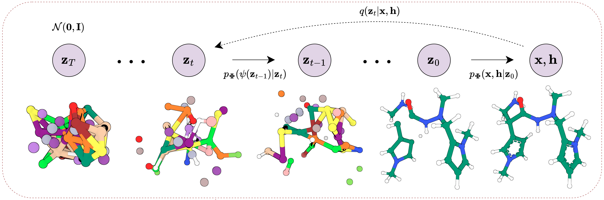

<div align="center">

# Bio-Diffusion

<a href="https://pytorch.org/get-started/locally/"></a>
<a href="https://pytorchlightning.ai/"></a>
<a href="https://hydra.cc/"></a>
[](https://arxiv.org/abs/2302.04313)
<!-- [](https://papers.nips.cc/paper/2020) -->
[](https://doi.org/10.5281/zenodo.7881981)
[](https://doi.org/10.5281/zenodo.10995319)



</div>

## Description

This is the official codebase of the paper

**Geometry-Complete Diffusion for 3D Molecule Generation and Optimization**, *Nature CommsChem*

[[arXiv](https://arxiv.org/abs/2302.04313)] [[Nature CommsChem](https://www.nature.com/articles/s42004-024-01233-z)]

<div align="center">


</div>

## Contents

- [System requirements](#system-requirements)
- [Installation guide](#installation-guide)
- [Demo](#demo)
  - [Generate new unconditional 3D molecules (**QM9**)](#generate-new-unconditional-3d-molecules-qm9)
  - [Generate new property-conditional 3D molecules (**QM9**)](#generate-new-property-conditional-3d-molecules-qm9-conditional)
  - [Generate new unconditional 3D molecules (**GEOM-Drugs**)](#generate-new-unconditional-3d-molecules-geom-drugs)
  - [Optimize 3D molecules for molecular stability and various molecular properties (**QM9**)](#optimize-3d-molecules-for-molecular-stability-and-various-molecular-properties-qm9)
- [Instructions for use](#instructions-for-use)
  - [How to train new models](#how-to-train-new-models)
    - [Train model with default configuration](#train-model-with-default-configuration)
    - [Train model with chosen experiment configuration](#train-model-with-chosen-experiment-configuration-from-configsexperiment)
    - [Train a model for *unconditional* small molecule generation (**QM9**)](#train-a-model-for-unconditional-small-molecule-generation-with-the-qm9-dataset-qm9)
    - [Train a model for *property-conditional* small molecule generation (**QM9**)](#train-a-model-for-property-conditional-small-molecule-generation-with-the-qm9-dataset-qm9)
    - [Train a model for *unconditional* drug-size molecule generation (**GEOM-Drugs**)](#train-a-model-for-unconditional-drug-size-molecule-generation-with-the-geom-drugs-dataset-geom)
  - [How to reproduce paper results](#how-to-reproduce-paper-results)
    - [Reproduce paper results for *unconditional* small molecule generation (**QM9**)](#reproduce-paper-results-for-unconditional-small-molecule-generation-with-the-qm9-dataset-2-hrs)
    - [Reproduce paper results for *property-conditional* small molecule generation (**QM9**)](#reproduce-paper-results-for-property-conditional-small-molecule-generation-with-the-qm9-dataset-12-hrs)
    - [Reproduce paper results for *unconditional* drug-size molecule generation (**GEOM-Drugs**)](#reproduce-paper-results-for-unconditional-drug-size-molecule-generation-with-the-geom-drugs-dataset-24-hrs)
    - [Reproduce paper results for *property-specific* small molecule optimization (**QM9**)](#reproduce-paper-results-for-property-specific-small-molecule-optimization-with-the-qm9-dataset-12-hrs)
    - [Reproduce paper results for *protein-conditional* small molecule generation (**Binding MOAD & CrossDocked**)](#reproduce-paper-results-for-protein-conditional-small-molecule-generation-with-the-binding-moad-and-crossdocked-datasets-binding-moad--crossdocked-5-days)

- [Docker](#docker)
- [Acknowledgements](#acknowledgements)
- [License](#license)
- [Citation](#citation)

## System requirements

### OS requirements
This package supports Linux. The package has been tested on the following Linux system:
`Description: AlmaLinux release 8.9 (Midnight Oncilla)`

### Python dependencies
This package is developed and tested under Python 3.9.x. The primary Python packages and their versions are as follows. For more details, please refer to the `environment.yaml` file.
```python
hydra-core=1.2.0
matplotlib-base=3.4.3
numpy=1.23.1
pyg=2.2.0=py39_torch_1.12.0_cu116
python=3.9.15
pytorch=1.12.1=py3.9_cuda11.6_cudnn8.3.2_0
pytorch-cluster=1.6.0=py39_torch_1.12.0_cu116
pytorch-scatter=2.1.0=py39_torch_1.12.0_cu116
pytorch-sparse=0.6.16=py39_torch_1.12.0_cu116
pytorch-lightning=1.7.7
scikit-learn=1.1.2
torchmetrics=0.10.2
```

## Installation guide

Install `mamba` (~500 MB: ~1 minute)

```bash
wget "https://github.com/conda-forge/miniforge/releases/latest/download/Mambaforge-$(uname)-$(uname -m).sh"
bash Mambaforge-$(uname)-$(uname -m).sh  # accept all terms and install to the default location
rm Mambaforge-$(uname)-$(uname -m).sh  # (optionally) remove installer after using it
source ~/.bashrc  # alternatively, one can restart their shell session to achieve the same result
```

Install dependencies (~15 GB: ~10 minutes)

```bash
# clone project
git clone https://github.com/BioinfoMachineLearning/bio-diffusion
cd bio-diffusion

# create conda environment
mamba env create -f environment.yaml
conda activate bio-diffusion  # note: one still needs to use `conda` to (de)activate environments

# install local project as package
pip3 install -e .
```

Download data (~100 GB extracted: ~4 hours)
```bash
# fetch, extract, and clean-up preprocessed data
wget https://zenodo.org/record/7881981/files/EDM.tar.gz
tar -xzf EDM.tar.gz
rm EDM.tar.gz
```

Download checkpoints (~5 GB extracted: ~5 minutes)

**Note**: Make sure to be located in the project's root directory beforehand (e.g., `~/bio-diffusion/`)
```bash
# fetch and extract model checkpoints directory
wget https://zenodo.org/record/10995319/files/GCDM_Checkpoints.tar.gz
tar -xzf GCDM_Checkpoints.tar.gz
rm GCDM_Checkpoints.tar.gz
```
**Note**: EGNN molecular property prediction checkpoints are also included within `GCDM_Checkpoints.tar.gz`, where three checkpoints per property were trained with random seeds (18 in total). Also included in this Zenodo model checkpoints record are trained GeoLDM (Xu et al. 2023) checkpoint files used to produce the benchmarking results in the accompanying GCDM manuscript.

## Demo
### Generate new unconditional 3D molecules (**QM9**)
*Unconditionally* generate small molecules similar to those contained within the QM9 dataset (~5 minutes)

```bash
python3 src/mol_gen_sample.py datamodule=edm_qm9 model=qm9_mol_gen_ddpm logger=csv trainer.accelerator=gpu trainer.devices=[0] ckpt_path="checkpoints/QM9/Unconditional/model_1_epoch_979-EMA.ckpt" num_samples=250 num_nodes=19 all_frags=true sanitize=false relax=false num_resamplings=1 jump_length=1 num_timesteps=1000 output_dir="./" seed=123
```

**NOTE**: Output `.sdf` files will be stored in the current working directory by default. Specify this using `output_dir`. Run `python3 src/mol_gen_sample.py --help` to view an exhaustive list of available input arguments.

**CONSIDER**: Running `bust MY_GENERATED_MOLS.sdf` to determine which of the generated molecules are valid according to the PoseBusters software suite (~3 minutes).

### Generate new property-conditional 3D molecules (**QM9**)
*Property-conditionally* generate small molecules similar to those contained within the QM9 dataset (~10 minutes)

```bash
# alpha
python3 src/mol_gen_eval_conditional_qm9.py datamodule=edm_qm9 model=qm9_mol_gen_ddpm logger=csv trainer.accelerator=gpu trainer.devices=[0] datamodule.dataloader_cfg.num_workers=1 model.diffusion_cfg.sample_during_training=false generator_model_filepath="checkpoints/QM9/Conditional/alpha_model_epoch_1619-EMA.ckpt" property=alpha iterations=100 batch_size=100 sweep_property_values=true num_sweeps=10 output_dir="./" seed=123
# gap
python3 src/mol_gen_eval_conditional_qm9.py datamodule=edm_qm9 model=qm9_mol_gen_ddpm logger=csv trainer.accelerator=gpu trainer.devices=[0] datamodule.dataloader_cfg.num_workers=1 model.diffusion_cfg.sample_during_training=false generator_model_filepath="checkpoints/QM9/Conditional/gap_model_epoch_1659-EMA.ckpt" property=gap iterations=100 batch_size=100 sweep_property_values=true num_sweeps=10 output_dir="./" seed=123
# homo
python3 src/mol_gen_eval_conditional_qm9.py datamodule=edm_qm9 model=qm9_mol_gen_ddpm logger=csv trainer.accelerator=gpu trainer.devices=[0] datamodule.dataloader_cfg.num_workers=1 model.diffusion_cfg.sample_during_training=false generator_model_filepath="checkpoints/QM9/Conditional/homo_model_epoch_1879-EMA.ckpt" property=homo iterations=100 batch_size=100 sweep_property_values=true num_sweeps=10 output_dir="./" seed=123
# lumo
python3 src/mol_gen_eval_conditional_qm9.py datamodule=edm_qm9 model=qm9_mol_gen_ddpm logger=csv trainer.accelerator=gpu trainer.devices=[0] datamodule.dataloader_cfg.num_workers=1 model.diffusion_cfg.sample_during_training=false generator_model_filepath="checkpoints/QM9/Conditional/lumo_model_epoch_1619-EMA.ckpt" property=lumo iterations=100 batch_size=100 sweep_property_values=true num_sweeps=10 output_dir="./" seed=123
# mu
python3 src/mol_gen_eval_conditional_qm9.py datamodule=edm_qm9 model=qm9_mol_gen_ddpm logger=csv trainer.accelerator=gpu trainer.devices=[0] datamodule.dataloader_cfg.num_workers=1 model.diffusion_cfg.sample_during_training=false generator_model_filepath="checkpoints/QM9/Conditional/mu_model_epoch_1859-EMA.ckpt" property=mu iterations=100 batch_size=100 sweep_property_values=true num_sweeps=10 output_dir="./" seed=123
# Cv
python3 src/mol_gen_eval_conditional_qm9.py datamodule=edm_qm9 model=qm9_mol_gen_ddpm logger=csv trainer.accelerator=gpu trainer.devices=[0] datamodule.dataloader_cfg.num_workers=1 model.diffusion_cfg.sample_during_training=false generator_model_filepath="checkpoints/QM9/Conditional/Cv_model_epoch_1539-EMA.ckpt" property=Cv iterations=100 batch_size=100 sweep_property_values=true num_sweeps=10 output_dir="./" seed=123
```

**NOTE**: Output `.sdf` files will be stored in the current working directory by default. Specify this using `output_dir`. Run `python3 src/mol_gen_eval_conditional_qm9.py --help` to view an exhaustive list of available input arguments.

**CONSIDER**: Running `bust MY_GENERATED_MOLS.sdf` to determine which of the generated molecules are valid according to the PoseBusters software suite (~3 minutes).

### Generate new unconditional 3D molecules (**GEOM-Drugs**)
*Unconditionally* generate drug-size molecules similar to those contained within the GEOM-Drugs dataset (~15 minutes)

```bash
python3 src/mol_gen_sample.py datamodule=edm_geom model=geom_mol_gen_ddpm logger=csv trainer.accelerator=gpu trainer.devices=[0] ckpt_path="checkpoints/GEOM/Unconditional/36hq94x5_model_1_epoch_76-EMA.ckpt" num_samples=250 num_nodes=44 all_frags=true sanitize=false relax=false num_resamplings=1 jump_length=1 num_timesteps=1000 output_dir="./" seed=123
```

**NOTE**: Output `.sdf` files will be stored in the current working directory by default. Specify this using `output_dir`. Run `python3 src/mol_gen_sample.py --help` to view an exhaustive list of available input arguments.

**CONSIDER**: Running `bust MY_GENERATED_MOLS.sdf` to determine which of the generated molecules are valid according to the PoseBusters software suite (~3 minutes).

### Optimize 3D molecules for molecular stability and various molecular properties (**QM9**)

```bash
# e.g., unconditionally generate a batch of samples to property-optimize
# NOTE: alpha is listed here, but it will not be referenced for the (initial) unconditional molecule generation
python3 src/mol_gen_eval_optimization_qm9.py datamodule=edm_qm9 model=qm9_mol_gen_ddpm logger=csv trainer.accelerator=gpu trainer.devices=[0] datamodule.dataloader_cfg.num_workers=1 model.diffusion_cfg.sample_during_training=false unconditional_generator_model_filepath="checkpoints/QM9/Unconditional/model_1_epoch_979-EMA.ckpt" conditional_generator_model_filepath="checkpoints/QM9/Conditional/alpha_model_epoch_1619-EMA.ckpt" classifier_model_dir="checkpoints/QM9/Property_Classifiers/exp_class_alpha_seed_1" num_samples=1000 sampling_output_dir="./mols_to_optimize/" property=alpha iterations=10 num_optimization_timesteps=100 return_frames=1 generate_molecules_only=true use_pregenerated_molecules=false

# optimize generated samples for specific molecular properties, where alpha is used in this example
python3 src/mol_gen_eval_optimization_qm9.py datamodule=edm_qm9 model=qm9_mol_gen_ddpm logger=csv trainer.accelerator=gpu trainer.devices=[0] datamodule.dataloader_cfg.num_workers=1 model.diffusion_cfg.sample_during_training=false unconditional_generator_model_filepath="checkpoints/QM9/Unconditional/model_1_epoch_979-EMA.ckpt" conditional_generator_model_filepath="checkpoints/QM9/Conditional/alpha_model_epoch_1619-EMA.ckpt" classifier_model_dir="checkpoints/QM9/Property_Classifiers/exp_class_alpha_seed_1" num_samples=1000 sampling_output_dir="./mols_to_optimize/" property=alpha iterations=10 num_optimization_timesteps=100 return_frames=1 generate_molecules_only=false use_pregenerated_molecules=true save_molecules=true
```

**NOTE**: Output `.sdf` files will be stored under `./outputs/`. Run `python3 src/mol_gen_eval_optimization_qm9.py --help` to view an exhaustive list of available input arguments.

**CONSIDER**: Running `bust MY_GENERATED_MOLS.sdf` to determine which of the generated molecules are valid according to the PoseBusters software suite (~3 minutes).

## Instructions for use

### How to train new models

#### Train model with default configuration

```bash
# train on CPU
python src/train.py trainer=cpu

# train on GPU
python src/train.py trainer=gpu
```

#### Train model with chosen experiment configuration from [configs/experiment/](configs/experiment/)

```bash
python src/train.py experiment=experiment_name.yaml
```

#### Train a model for *unconditional* small molecule generation with the QM9 dataset (**QM9**)

```bash
python3 src/train.py experiment=qm9_mol_gen_ddpm.yaml
```

#### Train a model for *property-conditional* small molecule generation with the QM9 dataset (**QM9**)

```bash
# choose a value for `model.module_cfg.conditioning` from the properties `[alpha, gap, homo, lumo, mu, Cv]`
python3 src/train.py experiment=qm9_mol_gen_conditional_ddpm.yaml model.module_cfg.conditioning=[alpha]
```

#### Train a model for *unconditional* drug-size molecule generation with the GEOM-Drugs dataset (**GEOM-Drugs**)

```bash
python3 src/train.py experiment=geom_mol_gen_ddpm.yaml
```

**Note**: You can override any parameter from command line like this

```bash
python src/train.py trainer.max_epochs=20 datamodule.dataloader_cfg.batch_size=64
```

### How to reproduce paper results

#### Reproduce paper results for *unconditional* small molecule generation with the QM9 dataset (**QM9 Unconditional**: ~2 hrs)

```bash
# note: `trainer.devices=[0]` selects the CUDA device available at index `0` - customize as needed using e.g., `nvidia-smi`
python3 src/mol_gen_eval.py datamodule=edm_qm9 model=qm9_mol_gen_ddpm logger=csv trainer.accelerator=gpu trainer.devices=[0] ckpt_path="checkpoints/QM9/Unconditional/model_1_epoch_979-EMA.ckpt" datamodule.dataloader_cfg.num_workers=1 model.diffusion_cfg.sample_during_training=false num_samples=10000 sampling_batch_size=100 num_test_passes=5
# ... repeat 5 times in total ...
python3 src/mol_gen_eval.py datamodule=edm_qm9 model=qm9_mol_gen_ddpm logger=csv trainer.accelerator=gpu trainer.devices=[0] ckpt_path="checkpoints/QM9/Unconditional/model_1_epoch_979-EMA.ckpt" datamodule.dataloader_cfg.num_workers=1 model.diffusion_cfg.sample_during_training=false num_samples=10000 sampling_batch_size=100 num_test_passes=5
```

**NOTE**: Refer to `src/analysis/inference_analysis.py` and `src/analysis/molecule_analysis.py` to manually enter and analyze the unconditional results reported by the commands above.

#### Reproduce paper results for *property-conditional* small molecule generation with the QM9 dataset (**QM9 Conditional**: ~12 hrs)

```bash
# alpha (repeat for `classifier_model_dir="checkpoints/QM9/Property_Classifiers/exp_class_alpha_seed_$SEED"`, where `SEED=[1, 64, 83]`)
python3 src/mol_gen_eval_conditional_qm9.py datamodule=edm_qm9 model=qm9_mol_gen_ddpm logger=csv trainer.accelerator=gpu trainer.devices=[0] datamodule.dataloader_cfg.num_workers=1 model.diffusion_cfg.sample_during_training=false generator_model_filepath="checkpoints/QM9/Conditional/alpha_model_epoch_1619-EMA.ckpt" classifier_model_dir="checkpoints/QM9/Property_Classifiers/exp_class_alpha_seed_N" property=alpha iterations=100 batch_size=100
# gap (repeat for `classifier_model_dir="checkpoints/QM9/Property_Classifiers/exp_class_gap_$SEED"`, where `SEED=[1, 471, 43149]`)
python3 src/mol_gen_eval_conditional_qm9.py datamodule=edm_qm9 model=qm9_mol_gen_ddpm logger=csv trainer.accelerator=gpu trainer.devices=[0] datamodule.dataloader_cfg.num_workers=1 model.diffusion_cfg.sample_during_training=false generator_model_filepath="checkpoints/QM9/Conditional/gap_model_epoch_1659-EMA.ckpt" classifier_model_dir="checkpoints/QM9/Property_Classifiers/exp_class_gap_seed_N" property=gap iterations=100 batch_size=100
# homo (repeat for `classifier_model_dir="checkpoints/QM9/Property_Classifiers/exp_class_homo_$SEED"`, where `SEED=[1, 4, 14]`)
python3 src/mol_gen_eval_conditional_qm9.py datamodule=edm_qm9 model=qm9_mol_gen_ddpm logger=csv trainer.accelerator=gpu trainer.devices=[0] datamodule.dataloader_cfg.num_workers=1 model.diffusion_cfg.sample_during_training=false generator_model_filepath="checkpoints/QM9/Conditional/homo_model_epoch_1879-EMA.ckpt" classifier_model_dir="checkpoints/QM9/Property_Classifiers/exp_class_homo_seed_N" property=homo iterations=100 batch_size=100
# lumo (repeat for `classifier_model_dir="checkpoints/QM9/Property_Classifiers/exp_class_lumo_$SEED"`, where `SEED=[1, 427, 745]`)
python3 src/mol_gen_eval_conditional_qm9.py datamodule=edm_qm9 model=qm9_mol_gen_ddpm logger=csv trainer.accelerator=gpu trainer.devices=[0] datamodule.dataloader_cfg.num_workers=1 model.diffusion_cfg.sample_during_training=false generator_model_filepath="checkpoints/QM9/Conditional/lumo_model_epoch_1619-EMA.ckpt" classifier_model_dir="checkpoints/QM9/Property_Classifiers/exp_class_lumo_seed_N" property=lumo iterations=100 batch_size=100
# mu (repeat for `classifier_model_dir="checkpoints/QM9/Property_Classifiers/exp_class_mu_$SEED"`, where `SEED=[1, 39, 86]`)
python3 src/mol_gen_eval_conditional_qm9.py datamodule=edm_qm9 model=qm9_mol_gen_ddpm logger=csv trainer.accelerator=gpu trainer.devices=[0] datamodule.dataloader_cfg.num_workers=1 model.diffusion_cfg.sample_during_training=false generator_model_filepath="checkpoints/QM9/Conditional/mu_model_epoch_1859-EMA.ckpt" classifier_model_dir="checkpoints/QM9/Property_Classifiers/exp_class_mu_seed_N" property=mu iterations=100 batch_size=100
# Cv (repeat for `classifier_model_dir="checkpoints/QM9/Property_Classifiers/exp_class_Cv_$SEED"`, where `SEED=[1, 8, 89]`)
python3 src/mol_gen_eval_conditional_qm9.py datamodule=edm_qm9 model=qm9_mol_gen_ddpm logger=csv trainer.accelerator=gpu trainer.devices=[0] datamodule.dataloader_cfg.num_workers=1 model.diffusion_cfg.sample_during_training=false generator_model_filepath="checkpoints/QM9/Conditional/Cv_model_epoch_1539-EMA.ckpt" classifier_model_dir="checkpoints/QM9/Property_Classifiers/exp_class_Cv_seed_N" property=Cv iterations=100 batch_size=100
```

**NOTE**: Refer to `src/analysis/inference_analysis.py`, `src/analysis/molecule_analysis.py`, and `src/analysis/qm_analysis.py` to manually enter and analyze the property-conditional results reported by the commands above.

#### Reproduce paper results for *unconditional* drug-size molecule generation with the GEOM-Drugs dataset (**GEOM-Drugs Unconditional**: ~24 hrs)

```bash
python3 src/mol_gen_eval.py datamodule=edm_geom model=geom_mol_gen_ddpm logger=csv trainer.accelerator=gpu trainer.devices=[0] ckpt_path="checkpoints/GEOM/Unconditional/36hq94x5_model_1_epoch_76-EMA.ckpt" datamodule.dataloader_cfg.num_workers=1 model.diffusion_cfg.sample_during_training=false num_samples=10000 sampling_batch_size=100 num_test_passes=5
# ... repeat 5 times in total ...
python3 src/mol_gen_eval.py datamodule=edm_geom model=geom_mol_gen_ddpm logger=csv trainer.accelerator=gpu trainer.devices=[0] ckpt_path="checkpoints/GEOM/Unconditional/36hq94x5_model_1_epoch_76-EMA.ckpt" datamodule.dataloader_cfg.num_workers=1 model.diffusion_cfg.sample_during_training=false num_samples=10000 sampling_batch_size=100 num_test_passes=5
```

**NOTE**: Refer to `src/analysis/inference_analysis.py`, `src/analysis/molecule_analysis.py`, `src/analysis/qm_analysis.py`, and `src/analysis/bust_analysis.py` to manually enter and analyze the unconditional results reported by the commands above.

#### Reproduce paper results for *property-specific* small molecule optimization with the QM9 dataset (**QM9 Guided**: ~12 hrs)

```bash
# unconditionally generate a batch of samples to property-optimize
# NOTE: alpha is listed here, but it will not be referenced for the (initial) unconditional molecule generation
python3 src/mol_gen_eval_optimization_qm9.py datamodule=edm_qm9 model=qm9_mol_gen_ddpm logger=csv trainer.accelerator=gpu trainer.devices=[0] datamodule.dataloader_cfg.num_workers=1 model.diffusion_cfg.sample_during_training=false unconditional_generator_model_filepath="checkpoints/QM9/Unconditional/model_1_epoch_979-EMA.ckpt" conditional_generator_model_filepath="checkpoints/QM9/Conditional/alpha_model_epoch_1619-EMA.ckpt" classifier_model_dir="checkpoints/QM9/Property_Classifiers/exp_class_alpha_seed_1" num_samples=1000 sampling_output_dir="./optim_mols/" property=alpha iterations=10 num_optimization_timesteps=100 return_frames=1 generate_molecules_only=true use_pregenerated_molecules=false

# optimize generated samples for specific molecular properties
# alpha (repeat for `classifier_model_dir="checkpoints/QM9/Property_Classifiers/exp_class_alpha_seed_$SEED"`, where `SEED=[1, 64, 83]`)
python3 src/mol_gen_eval_optimization_qm9.py datamodule=edm_qm9 model=qm9_mol_gen_ddpm logger=csv trainer.accelerator=gpu trainer.devices=[0] datamodule.dataloader_cfg.num_workers=1 model.diffusion_cfg.sample_during_training=false unconditional_generator_model_filepath="checkpoints/QM9/Unconditional/model_1_epoch_979-EMA.ckpt" conditional_generator_model_filepath="checkpoints/QM9/Conditional/alpha_model_epoch_1619-EMA.ckpt" classifier_model_dir="checkpoints/QM9/Property_Classifiers/exp_class_alpha_seed_N" num_samples=1000 sampling_output_dir="./optim_mols/" property=alpha iterations=10 num_optimization_timesteps=100 return_frames=1 generate_molecules_only=false use_pregenerated_molecules=true
# gap (repeat for `classifier_model_dir="checkpoints/QM9/Property_Classifiers/exp_class_gap_$SEED"`, where `SEED=[1, 471, 43149]`)
python3 src/mol_gen_eval_optimization_qm9.py datamodule=edm_qm9 model=qm9_mol_gen_ddpm logger=csv trainer.accelerator=gpu trainer.devices=[0] datamodule.dataloader_cfg.num_workers=1 model.diffusion_cfg.sample_during_training=false unconditional_generator_model_filepath="checkpoints/QM9/Unconditional/model_1_epoch_979-EMA.ckpt" conditional_generator_model_filepath="checkpoints/QM9/Conditional/gap_model_epoch_1659-EMA.ckpt" classifier_model_dir="checkpoints/QM9/Property_Classifiers/exp_class_gap_seed_N" num_samples=1000 sampling_output_dir="./optim_mols/" property=gap iterations=10 num_optimization_timesteps=100 return_frames=1 generate_molecules_only=false use_pregenerated_molecules=true
# homo (repeat for `classifier_model_dir="checkpoints/QM9/Property_Classifiers/exp_class_homo_$SEED"`, where `SEED=[1, 4, 14]`)
python3 src/mol_gen_eval_optimization_qm9.py datamodule=edm_qm9 model=qm9_mol_gen_ddpm logger=csv trainer.accelerator=gpu trainer.devices=[0] datamodule.dataloader_cfg.num_workers=1 model.diffusion_cfg.sample_during_training=false unconditional_generator_model_filepath="checkpoints/QM9/Unconditional/model_1_epoch_979-EMA.ckpt" conditional_generator_model_filepath="checkpoints/QM9/Conditional/homo_model_epoch_1879-EMA.ckpt" classifier_model_dir="checkpoints/QM9/Property_Classifiers/exp_class_homo_seed_N" num_samples=1000 sampling_output_dir="./optim_mols/" property=homo iterations=10 num_optimization_timesteps=100 return_frames=1 generate_molecules_only=false use_pregenerated_molecules=true
# lumo (repeat for `classifier_model_dir="checkpoints/QM9/Property_Classifiers/exp_class_lumo_$SEED"`, where `SEED=[1, 427, 745]`)
python3 src/mol_gen_eval_optimization_qm9.py datamodule=edm_qm9 model=qm9_mol_gen_ddpm logger=csv trainer.accelerator=gpu trainer.devices=[0] datamodule.dataloader_cfg.num_workers=1 model.diffusion_cfg.sample_during_training=false unconditional_generator_model_filepath="checkpoints/QM9/Unconditional/model_1_epoch_979-EMA.ckpt" conditional_generator_model_filepath="checkpoints/QM9/Conditional/lumo_model_epoch_1619-EMA.ckpt" classifier_model_dir="checkpoints/QM9/Property_Classifiers/exp_class_lumo_seed_N" num_samples=1000 sampling_output_dir="./optim_mols/" property=lumo iterations=10 num_optimization_timesteps=100 return_frames=1 generate_molecules_only=false use_pregenerated_molecules=true
# mu (repeat for `classifier_model_dir="checkpoints/QM9/Property_Classifiers/exp_class_mu_$SEED"`, where `SEED=[1, 39, 86]`)
python3 src/mol_gen_eval_optimization_qm9.py datamodule=edm_qm9 model=qm9_mol_gen_ddpm logger=csv trainer.accelerator=gpu trainer.devices=[0] datamodule.dataloader_cfg.num_workers=1 model.diffusion_cfg.sample_during_training=false unconditional_generator_model_filepath="checkpoints/QM9/Unconditional/model_1_epoch_979-EMA.ckpt" conditional_generator_model_filepath="checkpoints/QM9/Conditional/mu_model_epoch_1859-EMA.ckpt" classifier_model_dir="checkpoints/QM9/Property_Classifiers/exp_class_mu_seed_N" num_samples=1000 sampling_output_dir="./optim_mols/" property=mu iterations=10 num_optimization_timesteps=100 return_frames=1 generate_molecules_only=false use_pregenerated_molecules=true
# Cv (repeat for `classifier_model_dir="checkpoints/QM9/Property_Classifiers/exp_class_Cv_$SEED"`, where `SEED=[1, 8, 89]`)
python3 src/mol_gen_eval_optimization_qm9.py datamodule=edm_qm9 model=qm9_mol_gen_ddpm logger=csv trainer.accelerator=gpu trainer.devices=[0] datamodule.dataloader_cfg.num_workers=1 model.diffusion_cfg.sample_during_training=false unconditional_generator_model_filepath="checkpoints/QM9/Unconditional/model_1_epoch_979-EMA.ckpt" conditional_generator_model_filepath="checkpoints/QM9/Conditional/Cv_model_epoch_1539-EMA.ckpt" classifier_model_dir="checkpoints/QM9/Property_Classifiers/exp_class_Cv_seed_N" num_samples=1000 sampling_output_dir="./optim_mols/" property=Cv iterations=10 num_optimization_timesteps=100 return_frames=1 generate_molecules_only=false use_pregenerated_molecules=true
```

**NOTE**: Refer to `src/analysis/optimization_analysis.py` to manually enter and plot the optimization results reported by the commands above.

#### Reproduce paper results for *protein-conditional* small molecule generation with the Binding MOAD and CrossDocked datasets (**Binding MOAD & CrossDocked**: ~5 days)

Please refer to the following dedicated GitHub repository for further details: https://github.com/BioinfoMachineLearning/GCDM-SBDD.

## Docker

To run this project in a Docker container, you can use the following commands:

```bash
## Build the image
docker build -t bio-diffusion .

## Run the container (with GPUs and mounting the current directory)
docker run -it --gpus all -v .:/mnt --name bio-diffusion bio-diffusion
```
__Note:__ You will still need to download the checkpoints and data as described in the installation guide. Then, update the Python commands to point to the desired local location of your files (e.g., `/mnt/checkpoints` and `/mnt/outputs`) once in the container.


## Acknowledgements

Bio-Diffusion builds upon the source code and data from the following projects:

* [ClofNet](https://github.com/mouthful/ClofNet)
* [DiffSBDD](https://github.com/arneschneuing/DiffSBDD)
* [e3_diffusion_for_molecules](https://github.com/ehoogeboom/e3_diffusion_for_molecules)
* [GBPNet](https://github.com/sarpaykent/GBPNet)
* [GCPNet](https://github.com/BioinfoMachineLearning/GCPNet)
* [gvp-pytorch](https://github.com/drorlab/gvp-pytorch)
* [lightning-hydra-template](https://github.com/ashleve/lightning-hydra-template)
* [PoseBusters](https://github.com/maabuu/posebusters)

We thank all their contributors and maintainers!

## License
This project is covered under the **MIT License**.

## Citation

If you use the code or data associated with this package or otherwise find this work useful, please cite:

```bibtex
@article{Morehead2024,
	title        = {Geometry-complete diffusion for 3D molecule generation and optimization},
	author       = {Morehead, Alex and Cheng, Jianlin},
	year         = 2024,
	month        = {Jul},
	day          = {03},
	journal      = {Communications Chemistry},
	volume       = 7,
	number       = 1,
	pages        = 150,
	doi          = {10.1038/s42004-024-01233-z},
	issn         = {2399-3669},
	url          = {https://doi.org/10.1038/s42004-024-01233-z},
	abstract     = {Generative deep learning methods have recently been proposed for generating 3D molecules using equivariant graph neural networks (GNNs) within a denoising diffusion framework. However, such methods are unable to learn important geometric properties of 3D molecules, as they adopt molecule-agnostic and non-geometric GNNs as their 3D graph denoising networks, which notably hinders their ability to generate valid large 3D molecules. In this work, we address these gaps by introducing the Geometry-Complete Diffusion Model (GCDM) for 3D molecule generation, which outperforms existing 3D molecular diffusion models by significant margins across conditional and unconditional settings for the QM9 dataset and the larger GEOM-Drugs dataset, respectively. Importantly, we demonstrate that GCDM's generative denoising process enables the model to generate a significant proportion of valid and energetically-stable large molecules at the scale of GEOM-Drugs, whereas previous methods fail to do so with the features they learn. Additionally, we show that extensions of GCDM can not only effectively design 3D molecules for specific protein pockets but can be repurposed to consistently optimize the geometry and chemical composition of existing 3D molecules for molecular stability and property specificity, demonstrating new versatility of molecular diffusion models. Code and data are freely available on GitHub.}
}
```
